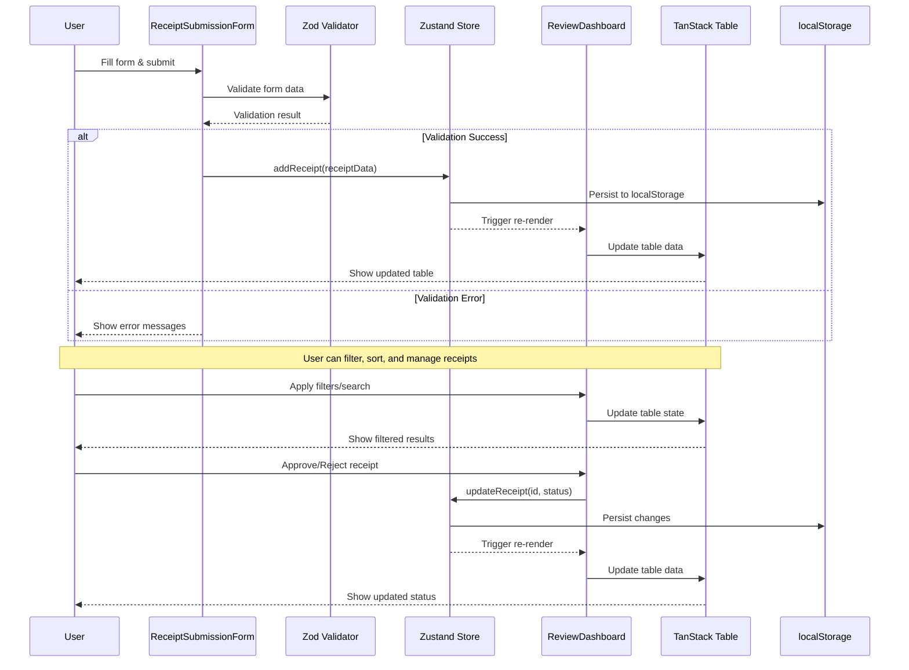

# 🏗️ Architecture Documentation

## System Overview

The ClaimClam Receipt Management System is built as a single-page application (SPA) using React 18 with TypeScript, following modern frontend architecture patterns. The application is designed to be stateless on the server side, with all data persistence handled client-side through localStorage.

## 📊 System Flow Diagram



## 🧩 Component Architecture

### Component Hierarchy
```
App
├── AppNavbar
│   ├── Brand (ClaimClam 🦪)
│   ├── Catchphrase ("Let's claim some clams")
│   └── Navigation Links
├── HomePage
├── ReceiptSubmissionForm
│   ├── Form Fields (Amount, Date, Vendor, etc.)
│   ├── FilePreview Component
│   └── Validation Messages
└── ReviewDashboard
    ├── Search & Filter Controls
    ├── Mobile Card View (Responsive)
    ├── Desktop Table View
    │   ├── Table Header (Sortable with Heroicons)
    │   ├── Table Body (Rows with fixed layout)
    │   └── Pagination Controls (with page indicators)
    ├── Floating Bulk Actions Bar
    └── ReceiptDetailsModal
        ├── Receipt Information Display (Two-column layout)
        ├── FilePreview Component (with modal)
        ├── Notes Section (with delete functionality)
        └── Action Buttons
├── ConfirmationDialog
│   ├── Title and Message
│   ├── Action Buttons
│   └── Variant Styling
└── FilePreview
    ├── Thumbnail Display
    ├── File Type Indicators
    └── Modal Preview
```

### Component Responsibilities

| Component | Responsibility | Props | State |
|-----------|---------------|-------|-------|
| **App** | Routing, Layout, Navigation | - | Route state |
| **AppNavbar** | Brand display, navigation, responsive design | - | Location state |
| **ReceiptSubmissionForm** | Form handling, validation, submission | - | Form state, upload progress |
| **ReviewDashboard** | Data display, filtering, bulk actions, responsive layout | - | Filter state, selection state, mobile view |
| **ReceiptDetailsModal** | Detailed view, notes, individual actions | `receipt`, `onClose` | Note input state, modal state |
| **ConfirmationDialog** | User confirmation for destructive actions | `isOpen`, `onClose`, `onConfirm`, `title`, `message`, `variant` | - |
| **FilePreview** | File thumbnail display and modal preview | `fileName`, `width`, `height`, `showModal`, `className` | Modal state |

## 🔄 State Management Flow

### Zustand Store Structure
```typescript
interface ReceiptStore {
  // State
  receipts: Receipt[]
  
  // Actions
  addReceipt: (receipt: Omit<Receipt, 'id' | 'submittedDate'>) => void
  updateReceipt: (id: number, updates: Partial<Receipt>) => void
  deleteReceipt: (id: number) => void
  bulkUpdateStatus: (ids: number[], status: Receipt['status']) => void
  addNote: (id: number, note: string) => void
  deleteNote: (id: number, noteIndex: number) => void
}
```

### State Flow Events

#### Receipt Submission Flow
1. **User Input** → Form state (React Hook Form)
2. **Form Validation** → Zod schema validation
3. **Validation Success** → Zustand store action
4. **Store Update** → localStorage persistence
5. **UI Update** → Component re-render

#### Receipt Management Flow
1. **User Action** (approve/reject) → Component handler
2. **Store Action** → Zustand store update
3. **Persistence** → localStorage sync
4. **UI Update** → Table re-render

#### Filtering & Search Flow
1. **User Input** → Local component state
2. **Filter Logic** → Fuse.js search + custom filters
3. **Table Update** → TanStack Table state
4. **UI Update** → Filtered results display

## 🔍 Validation Architecture

### Zod Schema Reuse Pattern
```typescript
// Base schema definition
const receiptSchema = z.object({
  amount: z.number().min(0.01).max(999999.99),
  date: z.string().refine(date => new Date(date) <= new Date()),
  vendor: z.string().min(1).max(100),
  // ... other fields
})

// Type inference for form data
type ReceiptFormData = z.infer<typeof receiptSchema>

// Reuse in React Hook Form
const form = useForm<ReceiptFormData>({
  resolver: zodResolver(receiptSchema)
})
```

### Validation Layers
1. **Client-side Validation**: Zod schema + React Hook Form
2. **Type Safety**: TypeScript interfaces
3. **Runtime Validation**: Zod schema parsing
4. **UI Feedback**: Real-time error display

## 📊 Data Flow Architecture

### Data Sources
- **Mock Data**: Static array in `mockReceipts.ts`
- **User Input**: Form submissions
- **Local Storage**: Zustand persistence layer

### Data Transformations
```typescript
// Raw form data → Validated data
FormData → Zod.parse() → ReceiptFormData

// Form data → Store data
ReceiptFormData → addReceipt() → Receipt

// Store data → Display data
Receipt[] → TanStack Table → Rendered rows

// Search data → Filtered data
Receipt[] → Fuse.js search → Filtered Receipt[]
```

## 🎨 Styling Architecture

### Tailwind CSS Strategy
- **Utility-first**: No custom CSS components
- **Responsive design**: Mobile-first breakpoints
- **Component variants**: Conditional classes
- **Design tokens**: Consistent spacing, colors, typography

### Responsive Breakpoints
```css
/* Mobile first approach */
.container { /* Base styles */ }

@media (min-width: 640px) { /* sm */ }
@media (min-width: 1024px) { /* md */ }
@media (min-width: 1280px) { /* lg */ }
```

## 🧪 Testing Architecture

### Test Structure
```
tests/
├── unit/                    # Unit tests
│   ├── setup.ts            # Test environment setup
│   ├── receiptSchema.test.ts # Validation tests
│   └── components.test.tsx  # Component tests
├── integration/             # Integration tests
│   ├── happy-paths.test.js  # User workflow tests
│   ├── error-cases.test.js  # Error handling tests
│   └── form-submission.test.js # Form integration tests
├── mcp/                     # Chrome DevTools MCP tests
│   ├── MCP_TEST_REPORT.md   # Test results
│   ├── QUICK_MCP_SETUP.md   # Setup guide
│   └── automation-testing.js # Automated MCP tests
└── run-all-tests.js         # Comprehensive test runner
```

### Testing Strategy
- **Unit Tests**: Individual functions and utilities
- **Integration Tests**: Component interactions
- **E2E Tests**: User workflows (future)

## 🚀 Performance Considerations

### Optimization Strategies
- **Code Splitting**: Route-based lazy loading
- **Memoization**: React.memo for expensive components
- **Virtual Scrolling**: For large datasets (future)
- **Debounced Search**: Prevent excessive filtering

### Bundle Analysis
- **Vite Bundle Analyzer**: Monitor bundle size
- **Tree Shaking**: Remove unused code
- **Dynamic Imports**: Load components on demand

## 🔒 Security Considerations

### Client-side Security
- **Input Sanitization**: Zod schema validation
- **XSS Prevention**: React's built-in escaping
- **File Validation**: Type and size checking
- **No Sensitive Data**: Mock data only

### Future Security Enhancements
- **CSRF Protection**: Backend integration
- **Authentication**: JWT tokens
- **Authorization**: Role-based access control
- **Data Encryption**: Sensitive data protection

## 📈 Scalability Considerations

### Current Limitations
- **Client-side Only**: No backend persistence
- **Memory Storage**: Limited by browser storage
- **Single User**: No multi-user support

### Future Scalability
- **Backend API**: RESTful or GraphQL
- **Database**: PostgreSQL or MongoDB
- **Caching**: Redis for performance
- **CDN**: Static asset delivery
- **Microservices**: Modular architecture

## 🔧 Development Workflow

### Build Process
1. **TypeScript Compilation**: Type checking
2. **Vite Bundling**: Module bundling
3. **Tailwind Processing**: CSS generation
4. **Asset Optimization**: Image and file optimization

### Development Tools
- **Vite Dev Server**: Hot module replacement
- **TypeScript**: Type checking and IntelliSense
- **ESLint**: Code linting (future)
- **Prettier**: Code formatting (future)

---

*This architecture documentation provides a comprehensive overview of the system design, data flow, and technical decisions made during development.*
